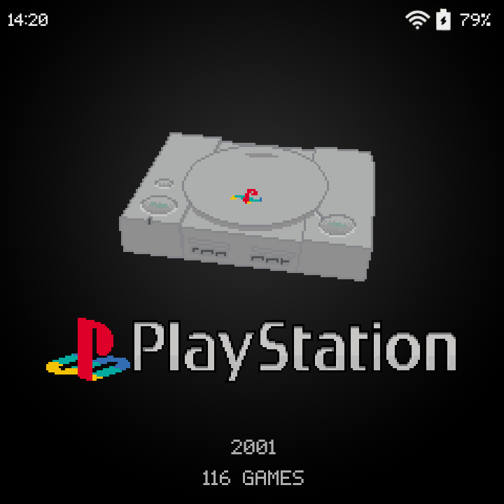

# Art Book Pixel

This is a modified Art Book Next theme for JelOS/Rocknix, forked from [es-theme-art-book-next-arkos](https://github.com/nkahoang/es-theme-art-book-next-arkos) using images from [es-theme-pixel](https://github.com/Jetup13/es-theme-pixel). Only the POWKIDDY RGB30 (screen aspect ratio 1:1) is supported currently.

You can follow the changes in `aspect-ratio-1-1.xml` if you would like to port this for other devices. Welcome any PR.

## Installation instructions
To install this:
- Go to https://github.com/SimoGecko/es-theme-art-book-pixel, click on Code -> Download ZIP
- Extract that zip to a folder named `es-theme-art-book-pixel`.
- Copy it to where you store themes (`/roms/themes/` or `/storage/.emulationstation/themes`)
- Enable the theme via EmulationStation settings (Start button) > UI Settings > `es-theme-art-book-pixel`
- Select aspect ratio (1:1), because the other aspect ratio isn't supported yet.

## **Acknowledgments**
* Original forked theme with respective acknowledgements: https://github.com/nkahoang/es-theme-art-book-next-arkos
* Pixel-art images for systems and logos: https://github.com/Jetup13/es-theme-pixel

## **License**
Attribution back to the repos mentioned above.
Creative Commons CC-BY-NC-SA - https://creativecommons.org/licenses/by-nc-sa/2.0/
You are free to share and adapt this theme as long as you provide attribution back to me (and the above credits) as well share any updates you make under the same licence terms.
